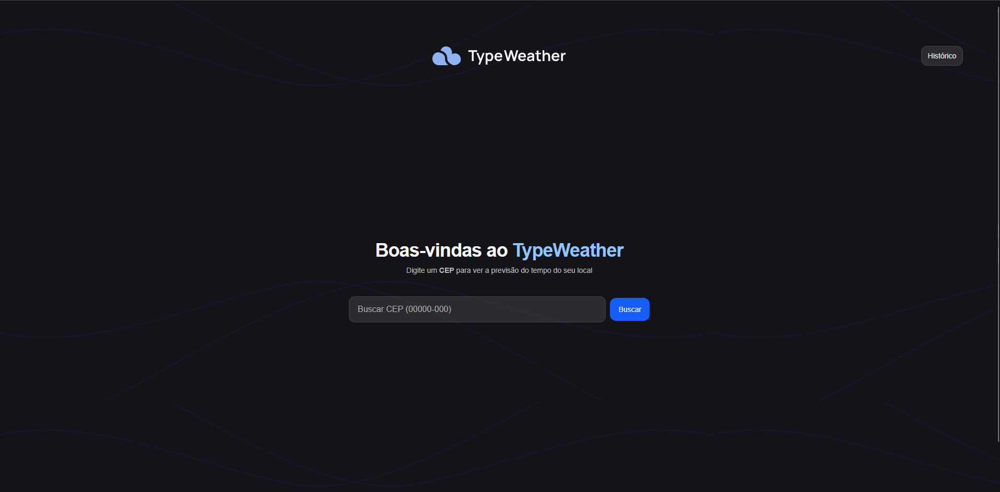
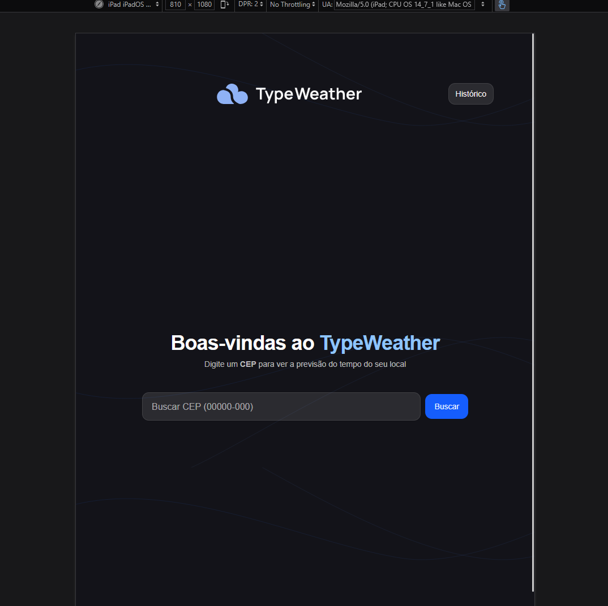
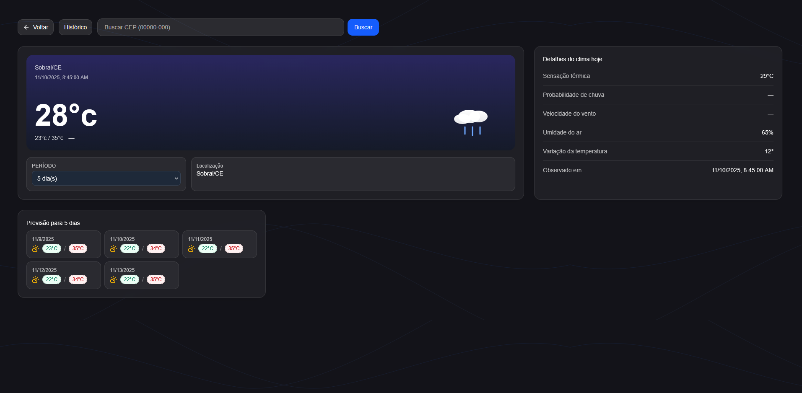
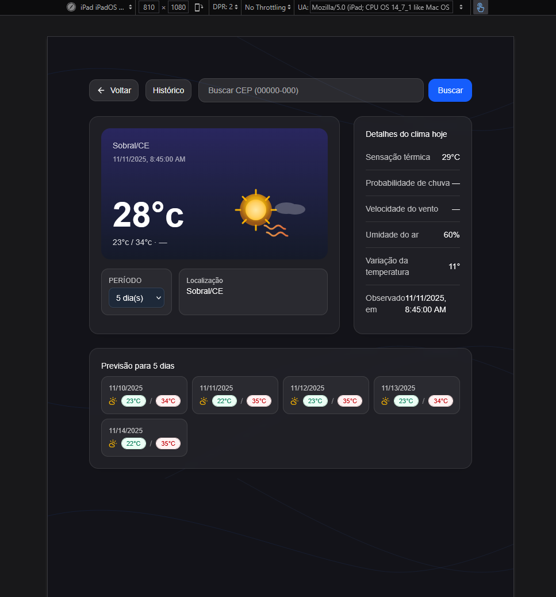
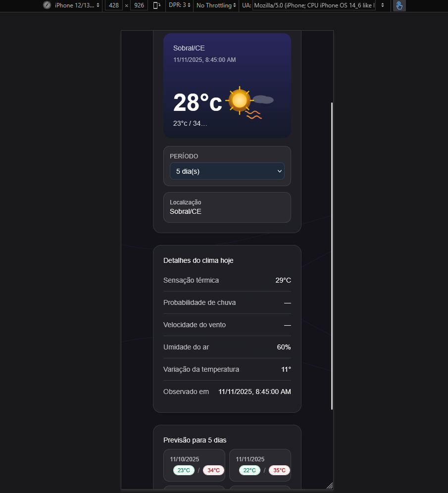
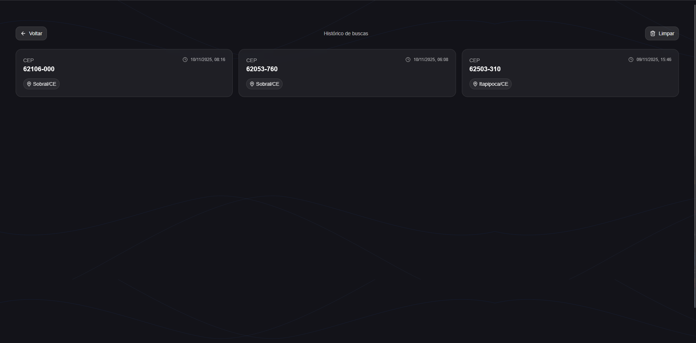
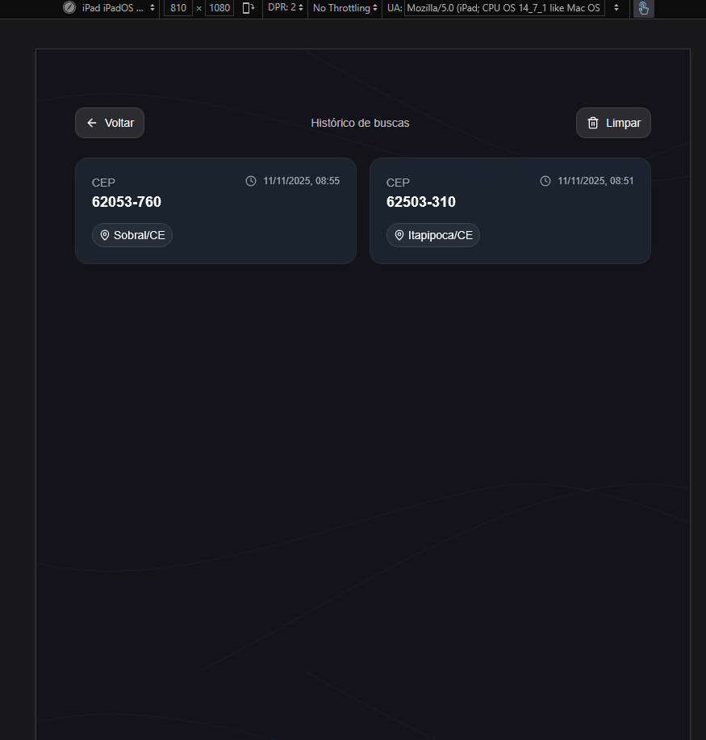
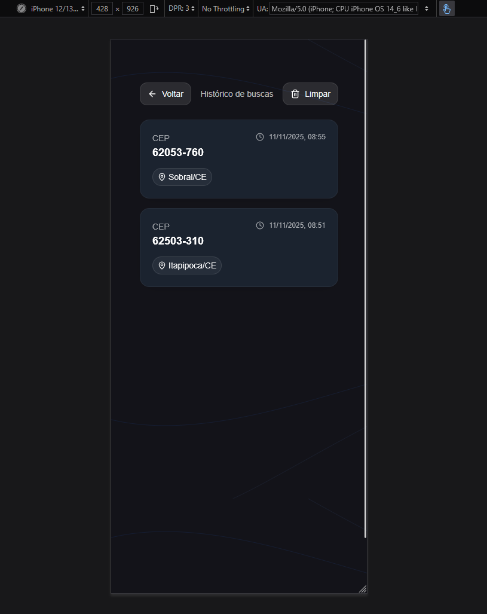

# 🌦️ TypeWeather

Aplicação para consulta de **CEP** e **previsão do tempo**, com histórico de buscas e interface moderna e responsiva.

---

## ✨ Funcionalidades

- Busca de endereço por CEP com validação
- Fallback automático de API (BrasilAPI → ViaCEP)
- Exibição completa do endereço encontrado
- Consulta de clima atual + previsão de 1 a 7 dias
- Seleção do período de previsão
- Histórico persistido de buscas no `localStorage`
- Re-execução da busca ao clicar no histórico
- Skeletons de carregamento
- Responsivo para mobile, tablet e desktop
- Tratamento elegante de erros com mensagens amigáveis

---

## 🖥️ Interface

### **Tela Inicial**
Permite digitar um CEP, exibe instruções e preserva foco na ação principal.





---

### **Dashboard de Clima**
Exibe temperatura atual, sensação térmica, umidade, vento e previsão para vários dias.





---

### **Histórico de Buscas**
Mostra as buscas recentes com CEP, cidade/UF e data.
Permite clicar para reabrir diretamente no dashboard.





---

## 🚀 Tecnologias Utilizadas

| Tecnologia | Utilização |
|---|---|
| **React 19+ + TypeScript** | Base da aplicação |
| **Vite** | Ambiente de build rápido |
| **React Router** | Navegação entre páginas |
| **Tailwind CSS** | Estilização responsiva |
| **TanStack Query** | Cache de requisições e reatividade |
| **Vitest + Testing Library** | Testes automatizados |
| **localStorage + useSyncExternalStore** | Histórico reativo |

---

## 🔗 APIs Utilizadas

| API | Função | URL |
|---|---|---|
| **BrasilAPI CEP v2** | Consulta de CEP primária | https://brasilapi.com.br/api/cep/v2/{cep} |
| **ViaCEP** | Fallback para consulta de CEP | https://viacep.com.br/ws/{cep}/json/ |
| **Open-Meteo Geocoding** | Converte Cidade/UF para latitude/longitude | https://geocoding-api.openmeteo.com/v1/search |
| **Open-Meteo Forecast** | Clima atual + previsão diária | https://api.open-meteo.com/v1/forecast |

---

## 🧭 Como Executar o Projeto


### **Instalar dependências**
Copie o env.example para .env e preencha com suas chaves de API.

### **1) Instalar dependências**
```bash
npm install
```

### **2) Rodar desenvolvimento**
```bash
npm run dev
```

## Docker
### **1) Gerar imagem**
```bash
docker build -t typeweather .
```
### **2) Rodar container**
```bash
docker run -p 5173:80 type-weather:latest
```

## Testes
### **1) Rodar suit de testes**
```bash
npm test
```

## Página do projeto publicado, visite:
https://typeweather-test.netlify.app/
